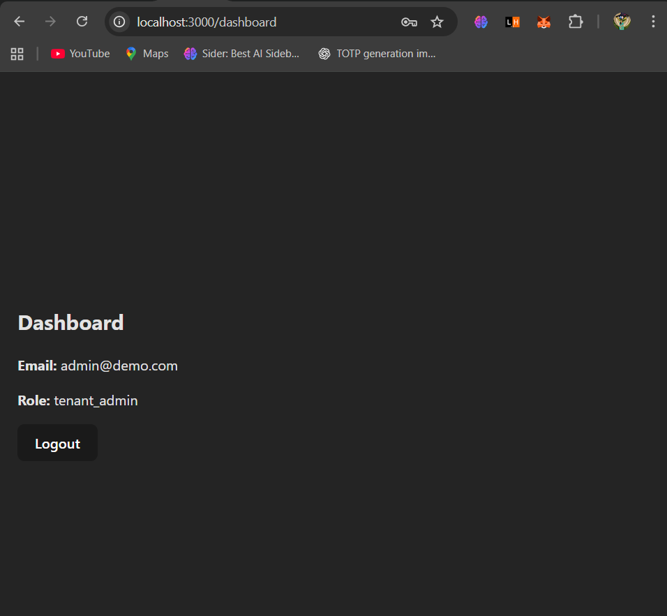

# System Architecture

## Overview

This project follows a **multi-tenant SaaS architecture** where a single application instance serves multiple tenants while maintaining strict data isolation and security.

The system is divided into three major layers:
- Frontend (Client)
- Backend (API Server)
- Database (PostgreSQL)

Each request is authenticated using JWT, and tenant context is enforced at the backend layer.

---

## High-Level Architecture Diagram

---

## Architecture Components

### 1. Frontend (React)

The frontend is a React-based web application responsible for:
- User login and authentication
- Dashboard rendering
- Making authenticated API requests
- Managing user interactions

The frontend stores the JWT token securely and sends it with every API request.

---

### 2. Backend (Node.js + Express)

The backend acts as the central control layer:
- Handles authentication and authorization
- Enforces tenant isolation
- Applies role-based access control (RBAC)
- Enforces subscription limits
- Communicates with PostgreSQL

Middleware layers ensure:
- JWT validation
- Tenant context injection
- Role checks (`super_admin`, `tenant_admin`, `user`)

---

### 3. Database (PostgreSQL)

PostgreSQL stores all application data:
- Tenants
- Users
- Projects
- Tasks
- Audit logs

Tenant isolation is achieved using a `tenant_id` foreign key across all tenant-specific tables.

---

## Authentication & Authorization Flow

1. User logs in with credentials
2. Backend validates credentials
3. JWT token is generated with:
   - userId
   - tenant_Id
   - role
4. Token is sent to frontend
5. Frontend sends token with every request
6. Backend middleware validates token and enforces access rules

---

## Subscription Enforcement Flow

Before creating resources:
- Backend checks tenant limits (`max_projects`, `max_users`)
- Current usage is calculated
- If limit exceeded → request blocked with **403 Forbidden**

---

## API Structure Overview

### Authentication APIs
- `POST /api/auth/login`
- `GET /api/auth/me`
- `POST /api/auth/logout`

### Tenant APIs (Super Admin)
- `GET /api/tenants`
- `GET /api/tenants/:id`
- `PUT /api/tenants/:id`

### User APIs
- `POST /api/tenants/:id/users`
- `GET /api/tenants/:id/users`
- `PUT /api/users/:id`

### Project APIs
- `GET /api/projects`
- `POST /api/projects`
- `PUT /api/projects/:id`
- `DELETE /api/projects/:id`

### Task APIs
- `GET /api/projects/:id/tasks`
- `POST /api/projects/:id/tasks`
- `PUT /api/tasks/:id`
- `DELETE /api/tasks/:id`

---

## UI Screenshots

### Login Page

### Dashboard Page

---

## Conclusion

This architecture ensures scalability, security, and maintainability while demonstrating real-world SaaS design principles such as multi-tenancy, RBAC, and subscription enforcement.
